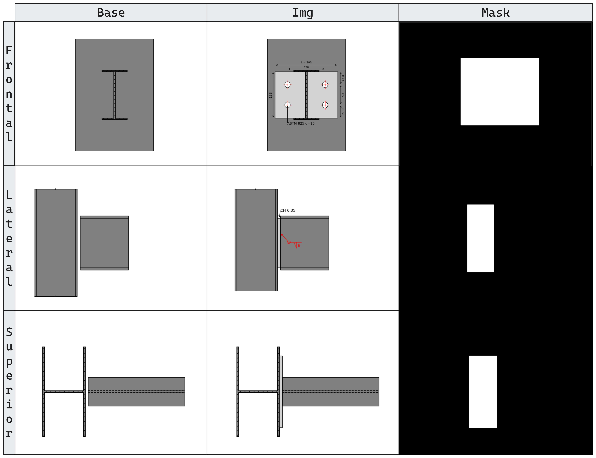

# SteelFLUX — Generative AI for Structural Steel Connections

> Master's research project. Fine-tuning of ACE++ (FluxFill inpainting model) 
> to automatically generate structural steel connections conditioned on 
> engineering design parameters.

## Overview

Steel connection design is a repetitive, high-expertise task with no 
automated solution in current practice. This research explores whether 
generative inpainting models can produce structurally plausible connection 
images conditioned on design data (loads, profiles, bolt patterns).

## Architecture

The pipeline has two decoupled components:

**1. Dataset Generator**
- Generates triplets: `(image, mask, base)` for inpainting training
- Stores design metadata in a SQLite database linked to each image
- Covers lateral, frontal, and superior views of connections

**2. Fine-tuning (ACE++ / FluxFill)**
- LoRA fine-tuning on the generated dataset
- Experiments tracked with varying rank, alpha, learning rate, and resolution

## Training History

| Experiment | LoRA Rank | Alpha | LR | Resolution | Best Score |
|------------|-----------|-------|----|------------|------------|
| 20251007 | 8 | 8 | 1e-4 | 720x720 | 6 |
| 20251012 | 32 | 32 | 1e-4 | 720x720 | 7 |
| 20251020 | 128 | 128 | 1e-4 | 1024x1024 | 4 |
| **20251027** | **32** | **32** | **1e-4** | **1024x1024** | **10** |
| 20251031 | 64 | 64 | 1e-4 | 1024x1024 | 8 |

> Best result: LoRA rank 32, alpha 32, LR 1e-4, 1024×1024

## Dataset Examples

*Samples from the automatically generated training dataset:*

## Results

### Lateral
.png)

### Frontal 
.png)

### Superior
.png)
